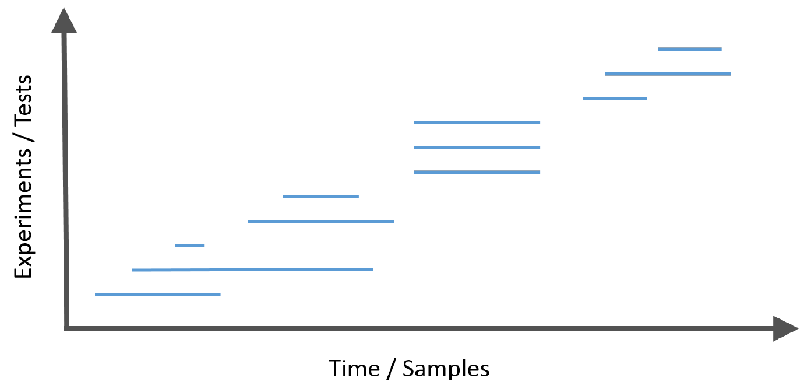
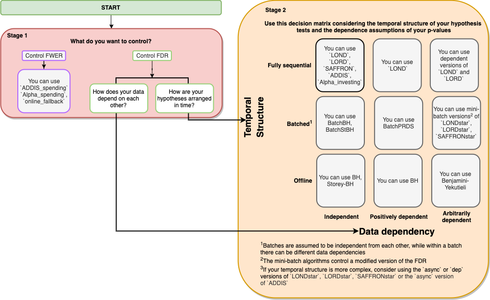

```{r setup, include = FALSE}
library(dplyr)
library(ggplot2)
library(tidyr)

knitr::opts_chunk$set(
    collapse = TRUE,
    comment = "#>"
)


```

---

## What is `onlineFDR`?

Multiple hypothesis testing is a fundamental problem in statistical inference.
The failure to manage the multiple testing problem has been highlighted as one
of the elements contributing to the replicability crisis in science (Ioannidis
2015). Methodologies have been developed for a family of hypotheses to adjust
the significance levels to manage the multiple testing situation by controlling
error metrics such as the familywise error rate (FWER) or the false discovery
rate (FDR).  

Frequently, modern data analysis problems have a further complexity that the
hypotheses arrive sequentially in a stream. 


This introduces the challenge that
at each step the investigator must decide whether to reject the current null
hypothesis without having access to the future p-values or the total number of
hypotheses to be tested, but does have knowledge of the historic decisions to
date. 

The onlineFDR package provides a family of algorithms you can apply to a historic or growing dataset to control FDR in an online manner. At a high-level, these algorithms rely on a concept called "alpha wealth" in which experiments cost some amount of error from your "budget" but a discovery earns some of the budget back. 


This vignette explains the two main uses of the package and demonstrates their typical workflows.

---

## Which algorithm do I use?

We strive to make our R package as easy to use as possible. 
Please see the flowchart below to decide which function is best to solve
your problem. The interactive version (click-to-functions) is available
[here](https://dsrobertson.github.io/onlineFDR/onlineFDR-diagram.html)



### Frequently Asked Questions
We also have a provided a non-exhaustive list of answers to some questions you may have when navigating the flowchart.

* What is the difference between FDR and FWER?
FDR is the expected proportion of false rejections out of all rejections. FWER is the probability of making any Type I errors at all. Controlling the FWER is generally more conservative than controlling the FDR. Note that in the case when all null hypotheses are true, the FDR and FWER are the same.

* What is the difference between sequential and non-sequential hypothesis testing?

* What does it mean for p-values to be independent or dependent?

## Quick Start

### General Info

This Quick Start guide is meant to provide a framework for you to use any of the algorithms within the `onlineFDR` package. The algorithms used in the examples below were selected arbitrarily for the sake of example.

#### Input data

In general, your dataset should contain, at the minimum, two columns (identifiers ('id') and p-values ('pval')). You can also pass in a date column ('date'), but that is optional; the p-values will be treated as being ordered sequentially. Alternatively, you can also use just the vector of p-values, in which case, the p-values will also be treated as being ordered sequentially. 

If you are using the Batch algorithms, ensure that your dataset contains a column ('batch') where batches are defined sequentially starting from 1. For more complex data structures, you may want to consider using the STAR algorithms (see `LONDstar()`, `LORDstar()`, and `SAFFRONstar()`). If you are not sure which algorithm to use, click [here](#which-function-do-i-use-).

All p-values generated should be passed to the function (and not
just the significant p-values).  An exception to this would be if you have
implemented an orthogonal filter to reduce the dataset size, such as discussed in (Burgon *et al.*, 2010).

#### What happens to the input data
If you're using `LOND()`, `LORD()`, or `SAFFRON()`, it orders the p-values by date. If there are multiple p-values with the same date (i.e. the same batch), the order of the p-values within each batch is randomised by default. Generally, users should randomise unless they have an *a priori* belief that hypotheses should be ordered in such way such that the ones with smaller p-values are rejected initially in the stream. In order for the randomisation of the p-values to be reproducible, it is necessary to set a seed (via the `set.seed` function) before calling the wrapper function.

Otherwise, the other algorithms will take in the p-values in the original order of the data. 

#### Understanding the output

For each hypothesis test, the functions calculate the adjusted significance
thresholds (`alphai`) at which the corresponding p-value would be declared
statistically significant.   

Also calculated is an indicator function of discoveries (`R`), where `R[i] = 1` corresponds to hypothesis i being rejected, otherwise `R[i] = 0`.  

A dataframe is returned with the original data and the newly calculated `alphai` and `R`.

### Using `onlineFDR` Exploratively
This package (and the corresponding [Shiny app](https://mrc-bsu.shinyapps.io/onlineFDRExplore/)) can be used in an exploratory way post-hoc. If you have a dataset of p-values for a series of experiments that have completed, you can use the algorithms provided in `onlineFDR` to explore how you could control the FDR and how the different algorithms have different levels of power. 

First, we initialize a toy dataset with three columns: an identifier ('id'), date ('date') and p-value ('pval'). Note that date should be in the format "YYYY-MM-DD".

```{r}
sample.df <- data.frame(
    id = c('A15432', 'B90969', 'C18705', 'B49731', 'E99902',
        'C38292', 'A30619', 'D46627', 'E29198', 'A41418',
        'D51456', 'C88669', 'E03673', 'A63155', 'B66033'),
    date = as.Date(c(rep("2014-12-01",3),
                    rep("2015-09-21",5),
                    rep("2016-05-19",2),
                    "2016-11-12",
                    rep("2017-03-27",4))),
    pval = c(2.90e-14, 0.06743, 0.01514, 0.08174, 0.00171,
            3.61e-05, 0.79149, 0.27201, 0.28295, 7.59e-08,
            0.69274, 0.30443, 0.000487, 0.72342, 0.54757))
```

Next, we call our algorithm of interest. Note that we also set a seed using the `set.seed` function in order for the results to be reproducible.

```{r}
library(onlineFDR)
library(Rcpp)

set.seed(1)
LOND_results <- LOND(sample.df)
LOND_results
```

To check how many hypotheses we've rejected, we can do:
```{r}
LOND_results %>%
  filter(R == 1) %>%
  nrow()
```

To compare the results of one algorithm to another, we can visualize the adjusted significance thresholds like this:
```{r}
set.seed(1)
LORD_results <- LORD(sample.df)

plot <- cbind(LOND_results, LORD_results$alphai) %>%
      mutate(index = row_number(),
             LOND = log(alphai),
             LORD = log(LORD_results$alphai),
             Bonferroni = log(0.05/index),
             Unadjusted = rep(log(0.05), nrow(.))) %>%
      pivot_longer(cols = c(LOND, LORD, Bonferroni, Unadjusted),
                   names_to = "adjustment",
                   values_to = "alpha") %>%
  ggplot(aes(x = index, y = alpha, col = adjustment)) + 
    geom_line() + 
    theme_bw() + 
  labs(x = "Index",
       y = "logalpha_i")

print(plot)
```

Note that both LOND and LORD result in much lower significance thresholds (logalpha_i) than an offline Bonferroni adjustment. When log_alphai jumps, that indicates that the algorithm is recovering some of it's "alpha wealth" when it makes a discovery. You can see how if the algorithm does not discover anything over time, it's alpha wealth decreases (the line will monotonically decrease), and it becomes harder to reject a null hypothesis since the significance threshold gets smaller and smaller. In this toy example, we also see that LORD is more powerful (bigger jumps or recoveries in "alpha wealth") compared to LOND.

### Using `onlineFDR` Sequentially
This package can be used in sequentially as your dataset grows. In order for the randomisation of the data within the previous batches to remain the same (and hence to allow for reproducibility of the results), *the same seed should be used for all analyses*. Ideally, you will have selected your algorithm *a priori* based on your needs (click [here](#which-function-do-i-use-). You can pass your growing dataset to the same algorithm. 

```{r}
sample.df <- data.frame(
    id = c('A15432', 'B90969', 'C18705'),
    date = as.Date(c(rep("2014-12-01",3))),
    pval = c(2.90e-14, 0.06743, 0.01514))

set.seed(1)
LOND_results <- LOND(sample.df)
```

```{r}
#after you've completed more experiments
sample.df <- data.frame(
    id = c('A15432', 'B90969', 'C18705', 'B49731', 'E99902',
        'C38292', 'A30619', 'D46627', 'E29198', 'A41418',
        'D51456', 'C88669', 'E03673', 'A63155', 'B66033'),
    date = as.Date(c(rep("2014-12-01",3),
                    rep("2015-09-21",5),
                    rep("2016-05-19",2),
                    "2016-11-12",
                    rep("2017-03-27",4))),
    pval = c(2.90e-14, 0.06743, 0.01514, 0.08174, 0.00171,
            3.61e-05, 0.79149, 0.27201, 0.28295, 7.59e-08,
            0.69274, 0.30443, 0.000487, 0.72342, 0.54757))

set.seed(1)
LOND_results <- LOND(sample.df)
```
---

## API

### Synchronous FDR Control
* `LOND()`
implements the LOND procedure for online FDR control, where LOND stands for
(significance) Levels based On Number of Discoveries, as presented by Javanmard
and Montanari (2015). The procedure controls the FDR for independent or
positively dependent (PRDS) p-values, with an option `(dep = TRUE)` which
guarantees control for arbitrarily dependent p-values.

* `LORD()`
implements the LORD procedure for online FDR control, where LORD stands for
(significance) Levels based On Recent Discovery, as presented by Javanmard and
Montanari (2018), Ramdas *et al.* (2017) and Tian & Ramdas (2019). The
function provides different versions of the procedure valid for independent
p-values, see `vignette("theory")`. There is also a version ('dep') that
guarantees control for dependent p-values.

* `SAFFRON()`
implements the SAFFRON procedure for online FDR control, where SAFFRON stands
for Serial estimate of the Alpha Fraction that is Futilely Rationed On true Null
hypotheses, as presented by Ramdas *et al.* (2018). The procedure provides an
adaptive method of online FDR control.

* `Alpha_investing()`
Implements a variant of the Alpha-investing algorithm of Foster and Stine (2008)
that guarantees FDR control, as proposed by Ramdas et al. (2018). This procedure
uses a variant of SAFFRON's update rule. This procedure controls the FDR for
independent p-values.

* `ADDIS()`
implements the ADDIS algorithm for online FDR control, where ADDIS stands for
an ADaptive algorithm that DIScards conservative nulls, as presented by Tian
& Ramdas (2019). The algorithm compensates for the power loss of SAFFRON
with conservative nulls, by including both adapativity in the fraction of
null hypotheses (like SAFFRON) and the conservativeness of nulls (unlike
SAFFRON). This procedure controls the FDR for independent p-values.

### Asynchronous FDR Control
* `LONDstar()`
implements the LOND algorithm for asynchronous online testing, as presented 
by Zrnic *et al.* (2018). This controls the mFDR.

* `LORDstar()`
implements LORD algorithms for asynchronous online testing, as presented by
Zrnic *et al.* (2018). This controls the mFDR.

* `SAFFRONstar()`
implements the SAFFRON algorithm for asynchronous online testing, as
presented by Zrnic *et al.* (2018). This controls the mFDR.

### FWER Control
* `Alpha_spending()`
implements online FWER control using a Bonferroni-like test. Alpha-spending
provides strong FWER control for arbitrarily dependent p-values.

* `online_fallback()`
implements the online fallback algorithm for FWER control, as proposed by
Tian & Ramdas (2019b). Online fallback is a uniformly more powerful method than
Alpha-spending, as it saves the significance level of a previous rejection.
Online fallback strongly controls the FWER for arbitrarily dependent p-values.

* `ADDIS_spending()`
implements the ADDIS-spending algorithm for online FWER control, as proposed by
Tian & Ramdas (2019b). The algorithm compensates for the power loss of
Alpha-spending, by including both adaptivity in the fraction of null hypotheses
and the conservativeness of nulls. ADDIS-spending provides strong FWER control
for independent p-values. Tian & Ramdas (2019b) also presented a version for
handling local dependence.

---

## How to get help for onlineFDR

All questions regarding onlineFDR should be posted to the
**Bioconductor support site**,  which serves as a searchable knowledge base of
questions and answers:

https://support.bioconductor.org

Posting a question and tagging with "onlineFDR" will automatically send an alert
to the package authors to respond on the support site.  

---

## Acknowledgements

We would like to thank the IMPC team (via Jeremy Mason and Hamed Haseli
Mashhadi) for useful discussions during the development of the package.

---

## References

Aharoni, E. and Rosset, S. (2014). Generalized $\alpha$-investing: definitions, 
optimality results and applications to public databases.
*Journal of the Royal Statistical Society (Series B)*, 76(4):771--794.

Benjamini, Y., and Yekutieli, D. (2001). The control of the false discovery rate
in multiple testing under dependency. *The Annals of Statistics*,
29(4):1165-1188.

Bourgon, R., Gentleman, R., and Huber, W. (2010). Independent filtering
increases detection power for high-throughput experiments. 
*Proceedings of the National Academy of Sciences*, 107(21), 9546-9551.

Foster, D. and Stine R. (2008). $\alpha$-investing: a procedure for sequential
control of expected false discoveries.
*Journal of the Royal Statistical Society (Series B)*, 29(4):429-444.

Ioannidis, J.P.A. (2005). Why most published research findings are false.
*PLoS Medicine*, 2.8:e124.

Javanmard, A., and Montanari, A. (2015). On Online Control of False
Discovery Rate. *arXiv preprint*, https://arxiv.org/abs/1502.06197.

Javanmard, A., and Montanari, A. (2018). Online Rules for Control of False
Discovery Rate and False Discovery Exceedance. *Annals of Statistics*, 
46(2):526-554.

Koscielny, G., *et al*. (2013). The International Mouse Phenotyping Consortium
Web Portal, a unified point of access for knockout mice and related phenotyping
data. *Nucleic Acids Research*, 42.D1:D802-D809.

Li, A., and Barber, F.G. (2017). Accumulation Tests for FDR Control in Ordered
Hypothesis Testing. *Journal of the American Statistical Association*, 
112(518):837-849.

Ramdas, A., Yang, F., Wainwright M.J. and Jordan, M.I. (2017). Online control
of the false discovery rate with decaying memory. 
*Advances in Neural Information Processing Systems 30*, 5650-5659.

Ramdas, A., Zrnic, T., Wainwright M.J. and Jordan, M.I. (2018). SAFFRON: an
adaptive algorithm for online control of the false discovery rate. 
*Proceedings of the 35th International Conference in Machine Learning*,
80:4286-4294.

Robertson, D.S. and Wason, J.M.S. (2018). Online control of the false discovery
rate in biomedical research. *arXiv preprint*, https://arxiv.org/abs/1809.07292.

Robertson, D.S., Wildenhain, J., Javanmard, A. and Karp, N.A. (2019).
Online control of the false discovery rate in biomedical research.
*Bioinformatics*, 35:4196-4199, https://doi.org/10.1093/bioinformatics/btz191.

Tian, J. and Ramdas, A. (2019a). ADDIS: an adaptive discarding algorithm for 
online FDR control with conservative nulls. *arXiv preprint*, 
https://arxiv.org/abs/1905.11465.

Tian, J. and Ramdas, A. (2019b). Online control of the familywise error rate.
*arXiv preprint*, https://arxiv.org/abs/1910.04900.

Zrnic, T., Ramdas, A. and Jordan, M.I. (2018). Asynchronous Online Testing of
Multiple Hypotheses. *arXiv preprint*, https://arxiv.org/abs/1812.05068.

---
